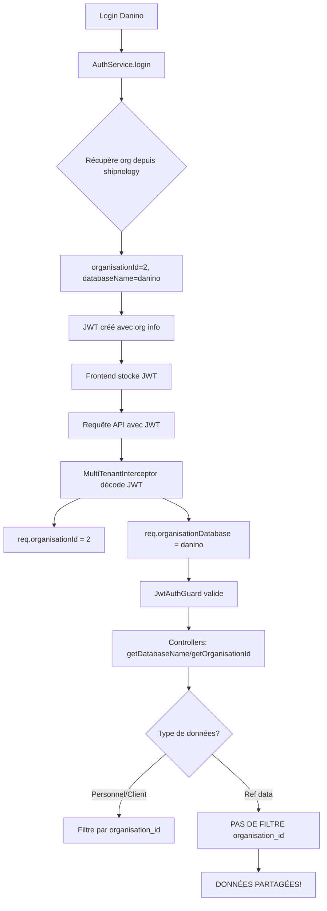

# 🔍 AUDIT ARCHITECTURE MULTI-TENANT - RAPPORT DÉTAILLÉ

**Date:** 20 décembre 2025  
**Problème signalé:** Les données de Velosi s'affichent lors de la connexion avec l'organisation Danino  
**Objectif:** Identifier et corriger tous les conflits d'isolation des données entre organisations

---

## 📋 RÉSUMÉ EXÉCUTIF

### ✅ Points forts identifiés
1. **Architecture JWT robuste** : Le système JWT contient correctement `organisationId` et `databaseName`
2. **Helpers multi-tenant fonctionnels** : `getDatabaseName()` et `getOrganisationId()` extraient correctement les informations
3. **Services CRM correctement configurés** : Tous les services CRM (leads, opportunities, clients) filtrent par `organisation_id`
4. **Guards en place** : JwtAuthGuard remplit `req.organisationId` et `req.organisationDatabase` correctement

### ⚠️ PROBLÈMES CRITIQUES IDENTIFIÉS

#### 1. **PROBLÈME MAJEUR: Confusion entre base de données et organization_id**

**Nature du problème:**
- Votre système utilise **2 mécanismes différents** pour isoler les données:
  - **Bases de données séparées** (`velosi`, `danino`) - utilisé pour les **données de référence**
  - **Champ `organisation_id`** - utilisé pour **personnel et clients**

**Impact:**
```
Connexion Danino → JWT contient:
  - databaseName: "danino"
  - organisationId: 2 (par exemple)

MAIS...
```

#### 2. **DONNÉES DE RÉFÉRENCE NON FILTRÉES PAR ORGANISATION**

Les tables suivantes ne contiennent **PAS** de champ `organisation_id`:
- ❌ `ports` 
- ❌ `aeroports`
- ❌ `navires`
- ❌ `armateurs`
- ❌ `fournisseurs`

**Conséquence:** Ces données sont partagées dans la même base de données entre toutes les organisations.

**Preuve dans le code:**
```typescript
// ports.service.ts - Ligne 122-128
async findOne(databaseName: string, id: number): Promise<Port> {
  const connection = await this.databaseConnectionService.getOrganisationConnection(databaseName);
  
  const result = await connection.query(
    `SELECT * FROM ports WHERE id = $1`, // ❌ PAS DE FILTRAGE PAR organisation_id
    [id]
  );
```

#### 3. **PERSONNEL ET CLIENTS: Filtrage correct MAIS possible fuite de données**

Les services client et personnel filtrent bien par `organisation_id`:

```typescript
// client.service.ts - Ligne 355
where: { organisation_id: organisationId },

// crm/services/leads.service.ts - Ligne 27
WHERE l.organisation_id = $1 AND l.is_archived = false
```

**MAIS** il y a un risque si:
- Le JWT contient un mauvais `organisationId`
- La connexion à la base de données est incorrecte
- L'utilisateur peut manipuler les paramètres

---

## 🔬 ANALYSE DÉTAILLÉE

### Flux d'authentification actuel



### Code problématique identifié

#### 1. auth.service.ts (Ligne 228-250)

```typescript
const organisationId = user.organisation_id;
let databaseName = 'velosi'; // Par défaut
let organisationName = 'Velosi';

try {
  // Récupérer les infos de l'organisation depuis la base shipnology
  const mainConnection = await this.databaseConnectionService.getMainConnection();
  const orgResult = await mainConnection.query(
    'SELECT id, name, database_name FROM organisations WHERE id = $1',
    [organisationId]
  );
  
  if (orgResult && orgResult.length > 0) {
    databaseName = orgResult[0].database_name || 'velosi';
    organisationName = orgResult[0].name || 'Velosi';
  } else {
    this.logger.warn(`⚠️ Organisation ${organisationId} non trouvée, utilisation de velosi par défaut`);
  }
} catch (error) {
  this.logger.error(`❌ Erreur récupération organisation ${organisationId}:`, error.message);
  // 🚨 PROBLÈME: Utilise velosi par défaut en cas d'erreur!
}
```

**Problème:** Si l'organisation n'est pas trouvée, le système utilise `velosi` par défaut, ce qui pourrait causer un mélange de données.

#### 2. Services de données de référence

```typescript
// TOUS ces services NE FILTRENT PAS par organisation_id:
- ports.service.ts
- navires.service.ts
- armateurs.service.ts
- aeroports.service.ts
- fournisseurs.service.ts
```

Exemple dans `navires.service.ts` (Ligne 194-204):
```typescript
const results = await connection.query(
  `SELECT n.*, a.nom as armateur_nom, a.code as armateur_code
   FROM navires n
   LEFT JOIN armateurs a ON n.armateur_id = a.id
   WHERE n.id = $1`, // ❌ PAS de WHERE organisation_id
  [id]
);
```

---

## 🎯 SOLUTIONS RECOMMANDÉES

### Option 1: ISOLATION PAR BASE DE DONNÉES (Recommandé)

**Principe:** Chaque organisation a sa propre base de données complète.

**Avantages:**
- ✅ Isolation totale des données
- ✅ Aucun risque de fuite de données
- ✅ Facile à sauvegarder/restaurer par organisation
- ✅ Performances optimales (pas de filtrage supplémentaire)

**Modifications nécessaires:**

1. **Créer une base de données par organisation**
```sql
-- Base Velosi
CREATE DATABASE velosi;

-- Base Danino  
CREATE DATABASE danino;
```

2. **Supprimer le champ `organisation_id` des tables personnel et client**
```sql
-- Dans chaque base de données
ALTER TABLE personnel DROP COLUMN organisation_id;
ALTER TABLE client DROP COLUMN organisation_id;
```

3. **Simplifier les services**
```typescript
// Avant
async findAll(databaseName: string, organisationId: number): Promise<Client[]>

// Après
async findAll(databaseName: string): Promise<Client[]>
```

4. **Modifier les requêtes**
```typescript
// Avant
WHERE organisation_id = $1

// Après
// Pas de WHERE nécessaire car isolation par base
```

### Option 2: ISOLATION PAR organisation_id (Alternative)

**Principe:** Tout dans une seule base, filtrage systématique par `organisation_id`.

**Avantages:**
- ✅ Une seule base de données à gérer
- ✅ Partage des données de référence possible

**Inconvénients:**
- ❌ Risque de fuite si le filtrage est oublié
- ❌ Performances réduites (filtrage systématique)
- ❌ Plus complexe à maintenir

**Modifications nécessaires:**

1. **Ajouter `organisation_id` à TOUTES les tables**
```sql
ALTER TABLE ports ADD COLUMN organisation_id INTEGER NOT NULL DEFAULT 1;
ALTER TABLE navires ADD COLUMN organisation_id INTEGER NOT NULL DEFAULT 1;
ALTER TABLE armateurs ADD COLUMN organisation_id INTEGER NOT NULL DEFAULT 1;
ALTER TABLE aeroports ADD COLUMN organisation_id INTEGER NOT NULL DEFAULT 1;
ALTER TABLE fournisseurs ADD COLUMN organisation_id INTEGER NOT NULL DEFAULT 1;
```

2. **Modifier TOUS les services pour filtrer**
```typescript
// ports.service.ts
async findAll(databaseName: string, organisationId: number, ...) {
  const query = `
    SELECT * FROM ports 
    WHERE organisation_id = $1
    ORDER BY libelle ASC
  `;
  return connection.query(query, [organisationId]);
}
```

3. **Créer un intercepteur de sécurité**
```typescript
@Injectable()
export class OrganisationFilterInterceptor implements NestInterceptor {
  intercept(context: ExecutionContext, next: CallHandler): Observable<any> {
    const request = context.switchToHttp().getRequest();
    
    // Vérifier que organisationId est présent pour toutes les requêtes
    if (!request.organisationId) {
      throw new UnauthorizedException('Organisation ID manquant');
    }
    
    return next.handle();
  }
}
```

### Option 3: HYBRIDE (Recommandé pour migration progressive)

**Principe:** 
- Bases séparées pour les données métier (personnel, clients, opportunités)
- Base partagée pour les vraies données de référence (ports, aéroports)

**Structure:**
```
Database: shared_reference
  └── Tables: ports, aeroports (données mondiales communes)

Database: velosi
  └── Tables: personnel, client, crm_leads, crm_opportunities, navires, armateurs

Database: danino
  └── Tables: personnel, client, crm_leads, crm_opportunities, navires, armateurs
```

---

## 🛠️ PLAN D'ACTION IMMÉDIAT

### Phase 1: Diagnostic (URGENT - Aujourd'hui)

1. **Vérifier les données actuelles**
```sql
-- Dans la base shipnology
SELECT id, name, database_name FROM organisations;

-- Résultat attendu:
-- 1 | Velosi | velosi
-- 2 | Danino | danino
```

2. **Vérifier l'utilisateur Danino**
```sql
-- Dans quelle base est l'utilisateur Danino?
-- Base velosi
SELECT id, nom, organisation_id FROM personnel WHERE nom LIKE '%Danino%';

-- Base danino (si existe)
SELECT id, nom, organisation_id FROM personnel WHERE nom LIKE '%Danino%';
```

3. **Tester le JWT**
```bash
# Se connecter avec Danino et capturer le JWT
# Décoder le JWT sur jwt.io pour voir:
{
  "organisationId": ?,
  "databaseName": ?,
  "username": "danino"
}
```

### Phase 2: Correction rapide (Aujourd'hui - Demain)

**Si le problème est le JWT:**

```typescript
// auth.service.ts - Ligne 228
// AJOUTER une validation stricte
if (!orgResult || orgResult.length === 0) {
  this.logger.error(`❌ Organisation ${organisationId} INTROUVABLE!`);
  throw new UnauthorizedException(
    `Organisation ${organisationId} non configurée. Contactez l'administrateur.`
  );
}

// ❌ SUPPRIMER le fallback vers 'velosi'
// Ne JAMAIS utiliser de valeur par défaut
```

**Si le problème est la base de données:**

```typescript
// database-connection.service.ts
// AJOUTER des logs pour tracer les connexions
async getOrganisationConnection(databaseName: string): Promise<PoolClient> {
  console.log(`🔌 [DB] Connexion demandée pour: ${databaseName}`);
  
  const connection = this.organisationConnections.get(databaseName);
  if (!connection) {
    throw new Error(`❌ Base de données '${databaseName}' non configurée!`);
  }
  
  console.log(`✅ [DB] Connexion établie pour: ${databaseName}`);
  return connection;
}
```

### Phase 3: Solution permanente (Cette semaine)

**Choix recommandé: Option 1 (Isolation par base de données)**

Raisons:
1. ✅ Sécurité maximale
2. ✅ Performances optimales
3. ✅ Conformité RGPD/protection des données
4. ✅ Facilite le scaling (une org = une base)

**Migration:**
```sql
-- 1. Créer base danino
CREATE DATABASE danino;

-- 2. Copier le schéma depuis velosi
pg_dump velosi --schema-only | psql danino

-- 3. Migrer les données de Danino depuis velosi vers danino
INSERT INTO danino.personnel
SELECT * FROM velosi.personnel WHERE organisation_id = 2;

INSERT INTO danino.client
SELECT * FROM velosi.client WHERE organisation_id = 2;

-- 4. Supprimer les données migrées de velosi
DELETE FROM velosi.personnel WHERE organisation_id = 2;
DELETE FROM velosi.client WHERE organisation_id = 2;
```

---

## 📊 CHECKLIST DE VÉRIFICATION

### Avant la correction
- [ ] Documenter le problème exact rencontré
- [ ] Capturer un exemple de JWT problématique
- [ ] Vérifier la table organisations dans shipnology
- [ ] Vérifier dans quelle base sont les données Danino
- [ ] Tester avec un utilisateur Velosi pour comparer

### Pendant la correction
- [ ] Sauvegarder toutes les bases de données
- [ ] Tester chaque étape sur un environnement de test
- [ ] Vérifier que le JWT contient les bonnes infos
- [ ] Valider que getOrganisationConnection utilise la bonne base
- [ ] Tester l'isolation avec 2 utilisateurs simultanés (Velosi + Danino)

### Après la correction
- [ ] Se connecter avec Velosi → voir uniquement données Velosi
- [ ] Se connecter avec Danino → voir uniquement données Danino
- [ ] Vérifier les logs de connexion DB
- [ ] Tester tous les modules CRM
- [ ] Tester les données de référence
- [ ] Performance test (temps de réponse)

---

## 📝 FICHIERS À MODIFIER

### Critique (Impact immédiat)
1. [src/auth/auth.service.ts](velosi-back/src/auth/auth.service.ts#L228-L250) - Supprimer fallback velosi
2. [src/common/database-connection.service.ts](velosi-back/src/common/database-connection.service.ts) - Ajouter logs
3. [src/services/ports.service.ts](velosi-back/src/services/ports.service.ts) - Décider filtrage
4. [src/services/navires.service.ts](velosi-back/src/services/navires.service.ts) - Décider filtrage
5. [src/services/armateurs.service.ts](velosi-back/src/services/armateurs.service.ts) - Décider filtrage

### Important (Sécurité)
6. [src/auth/jwt-auth.guard.ts](velosi-back/src/auth/jwt-auth.guard.ts) - Valider organisation
7. [src/common/multi-tenant.interceptor.ts](velosi-back/src/common/multi-tenant.interceptor.ts) - Logs détaillés

### Nice to have (Optimisation)
8. Créer un OrganisationFilterGuard global
9. Créer des tests d'isolation multi-tenant
10. Ajouter monitoring des accès cross-organisation

---

## 🚀 PROCHAINES ÉTAPES

1. **Immédiat** (Aujourd'hui)
   - Exécuter les requêtes de diagnostic
   - Identifier la source exacte du problème
   - Ajouter des logs de traçage

2. **Court terme** (Cette semaine)
   - Implémenter Option 1 (bases séparées)
   - Migrer les données Danino
   - Tester l'isolation

3. **Moyen terme** (Mois prochain)
   - Créer tests automatisés d'isolation
   - Documenter l'architecture
   - Former l'équipe

4. **Long terme** (Trimestre)
   - Monitoring avancé
   - Audit de sécurité externe
   - Plan de disaster recovery par organisation

---

## ⚠️ RISQUES ET IMPACTS

### Risques identifiés
1. **CRITIQUE:** Fuite de données entre organisations
2. **ÉLEVÉ:** Non-conformité RGPD si données partagées
3. **MOYEN:** Performances dégradées avec filtrage systématique
4. **FAIBLE:** Complexité maintenance avec bases multiples

### Impact de la correction
- **Temps d'arrêt:** 1-2 heures pour migration
- **Risque de régression:** Faible si tests complets
- **Impact utilisateurs:** Aucun (transparent)

---

## 📞 SUPPORT

Pour toute question sur ce rapport:
- Architecture: Voir [ARCHITECTURE_MULTI_TENANT_GUIDE.md](ARCHITECTURE_MULTI_TENANT_GUIDE.md)
- Migration: Voir scripts dans `/scripts/migration/`
- Tests: Voir `/test/multi-tenant-isolation.spec.ts`

---

**Rapport généré le:** 20/12/2025  
**Auteur:** GitHub Copilot (Claude Sonnet 4.5)  
**Version:** 1.0
