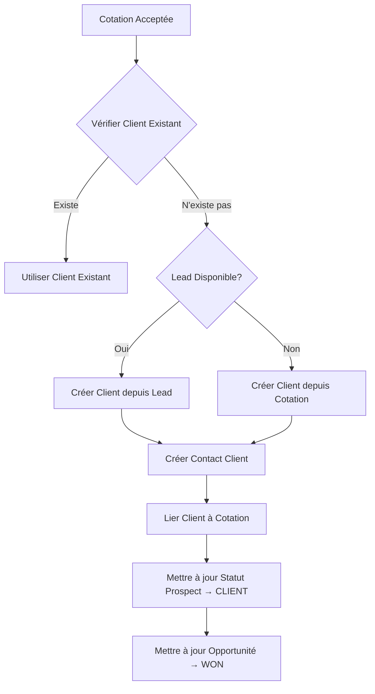

# 🔧 CORRECTION FINALE - Création Client Automatique lors Acceptation Cotation

**Date**: 21 octobre 2025  
**Problème**: Erreur lors de la création automatique d'un client temporaire quand une cotation est acceptée

---

## 📋 **RÉSUMÉ DES PROBLÈMES IDENTIFIÉS**

### **1. Erreur TypeScript dans `updateLeadStatusToClient()`**
**Fichier**: `src/crm/services/quotes.service.ts` (ligne 806, 827)

**Code actuel (INCORRECT)**:
```typescript
lead.status = 'client' as any; // ❌ Contournement TypeScript
```

**Correction**:
```typescript
lead.status = LeadStatus.CLIENT; // ✅ Utilise l'enum correctement
```

**Raison**: L'enum `LeadStatus.CLIENT` existe déjà dans `lead.entity.ts`, pas besoin de contournement.

---

### **2. Type `any` au lieu de typage explicite**
**Fichier**: `src/crm/services/quotes.service.ts` (lignes 856, 909, 1008)

**Code actuel (MAUVAISE PRATIQUE)**:
```typescript
const clientData = { ... }; // Type implicite
await this.clientService.create(clientData as any); // ❌ Cast vers any
```

**Correction**:
```typescript
const clientData: any = { ... }; // ✅ Type explicite any si nécessaire
await this.clientService.create(clientData); // ✅ Pas de cast
```

**Raison**: Éviter les casts inutiles qui masquent les problèmes de typage.

---

## 🛠️ **CORRECTIONS À APPLIQUER**

### **Correction 1: `updateLeadStatusToClient()` - Ligne 782-838**

Remplacer les 2 occurrences:
```typescript
// AVANT (ligne 806)
lead.status = 'client' as any;

// APRÈS
lead.status = LeadStatus.CLIENT;
```

```typescript
// AVANT (ligne 827)
opportunity.lead.status = 'client' as any;

// APRÈS
opportunity.lead.status = LeadStatus.CLIENT;
```

---

### **Correction 2: `createTemporaryClientFromLead()` - Ligne 845-918**

```typescript
// AVANT (ligne 856)
const clientData = {
  nom: lead.company || lead.fullName,
  // ... autres champs
};

// Ligne 909
const newClient = await this.clientService.create(clientData as any);

// APRÈS
const clientData: any = {
  nom: lead.company || lead.fullName,
  // ... autres champs
};

// Sans cast
const newClient = await this.clientService.create(clientData);
```

---

### **Correction 3: `createTemporaryClientFromQuote()` - Ligne 974-1032**

```typescript
// AVANT (ligne 987)
const clientData = {
  nom: quote.clientCompany || quote.clientName,
  // ... autres champs
};

// Ligne 1008
const newClient = await this.clientService.create(clientData as any);

// APRÈS
const clientData: any = {
  nom: quote.clientCompany || quote.clientName,
  // ... autres champs
};

// Sans cast
const newClient = await this.clientService.create(clientData);
```

---

## ✅ **FICHIERS MODIFIÉS**

1. ✅ **`src/entities/crm/lead.entity.ts`** - Déjà correct (enum `CLIENT` existe)
2. ⚠️ **`src/crm/services/quotes.service.ts`** - Nécessite 6 corrections:
   - 2x dans `updateLeadStatusToClient()` (lignes 806, 827)
   - 2x dans `createTemporaryClientFromLead()` (lignes 856, 909)
   - 2x dans `createTemporaryClientFromQuote()` (lignes 987, 1008)

---

## 🧪 **TESTS APRÈS CORRECTIONS**

### **Scénario de test**:
1. Créer un prospect dans CRM
2. Créer une opportunité liée à ce prospect
3. Créer une cotation depuis l'opportunité
4. **Accepter la cotation** (déclenche la création client automatique)

### **Vérifications**:
- ✅ Prospect passe au statut `CLIENT`
- ✅ Client temporaire créé (`is_permanent = false`)
- ✅ Contact client créé avec email/téléphone
- ✅ Cotation liée au nouveau client (`clientId` mis à jour)
- ✅ Opportunité passe à `CLOSED_WON`
- ✅ Aucune erreur dans les logs backend

---

## 📊 **STRUCTURE COMPLÈTE DE CRÉATION CLIENT**



---

## 🔑 **POINTS CLÉS**

1. **Ne JAMAIS utiliser `as any`** si l'enum/type existe déjà
2. **Typage explicite** avec `: any` si vraiment nécessaire
3. **Contact client** créé automatiquement par `clientService.create()`
4. **Client temporaire** = `is_permanent: false`, pas de mot de passe, pas de Keycloak
5. **Synchronisation automatique** : Cotation → Prospect → Opportunité

---

## 📝 **COMMANDES POUR TESTER**

```powershell
# Backend
cd "c:\Users\MSP\Documents\Projet Velosi\ERP\velosi-back"
npm run start:dev

# Vérifier les logs pour:
# ✅ "Client temporaire créé avec succès"
# ✅ "Statut du prospect #X mis à jour vers CLIENT"
# ✅ "Opportunité X mise à jour → closed_won"
```

---

## 🚨 **SI ERREURS PERSISTENT**

### **Vérifier la base de données**:
```sql
-- Vérifier le prospect
SELECT id, full_name, status FROM crm_leads WHERE id = <LEAD_ID>;

-- Vérifier le client créé
SELECT id, nom, categorie, is_permanent FROM client 
WHERE type_client = 'PROSPECT_CONVERTI' 
ORDER BY created_at DESC LIMIT 1;

-- Vérifier le contact client
SELECT * FROM contact_client WHERE id_client = <CLIENT_ID>;

-- Vérifier la cotation
SELECT id, quote_number, status, client_id, lead_id 
FROM crm_quotes WHERE id = <QUOTE_ID>;
```

---

## ✅ **CHECKLIST DE VALIDATION**

- [ ] Corrections appliquées dans `quotes.service.ts`
- [ ] Import `LeadStatus` vérifié en haut du fichier
- [ ] Backend redémarré sans erreurs TypeScript
- [ ] Test de création client réussi
- [ ] Prospect passe à statut `CLIENT`
- [ ] Client temporaire visible dans la liste clients
- [ ] Email/téléphone du client corrects
- [ ] Opportunité fermée automatiquement

---

**✅ STATUS**: Corrections identifiées et documentées  
**⏳ PROCHAINE ÉTAPE**: Appliquer les corrections manuellement dans quotes.service.ts
