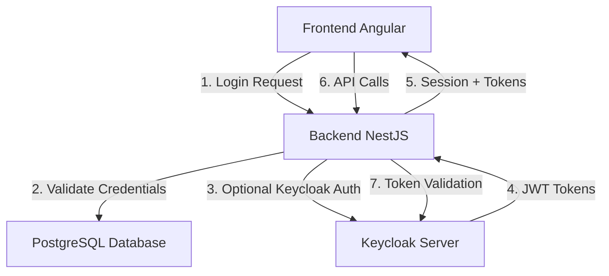

# 📚 Processus d'Authentification et de Gestion de Session - Documentation Complète

## 🎯 Vue d'Ensemble

Cette documentation explique en détail le processus d'authentification et de gestion de session dans l'application ERP Velosi, qui utilise une architecture hybride **Keycloak + Backend NestJS + Frontend Angular**.

---

## 🏗️ Architecture du Système d'Authentification



### Composants Principaux

1. **Frontend Angular** - Interface utilisateur et gestion de session côté client
2. **Backend NestJS** - API REST et logique d'authentification
3. **Keycloak** - Serveur d'identité et de gestion des tokens SSO
4. **PostgreSQL** - Base de données contenant les utilisateurs et leurs informations

---

## 🔐 Processus d'Authentification Détaillé

### Phase 1: Initialisation de l'Application

#### 1.1 Démarrage de l'Application Angular
```typescript
// app.config.ts - Configuration de l'initialisation
{
  provide: APP_INITIALIZER,
  useFactory: initializeKeycloak,
  deps: [AuthKeycloakService],
  multi: true
}
```

#### 1.2 Factory d'Initialisation
```typescript
// keycloak-init.factory.ts
export function initializeKeycloak(authService: AuthKeycloakService) {
  return (): Promise<boolean> => {
    // 1. Initialisation Keycloak
    // 2. Vérification silencieuse de l'authentification  
    // 3. Restauration de session si tokens valides
  }
}
```

**Étapes détaillées :**
1. **Tentative d'initialisation Keycloak** avec `check-sso`
2. **Vérification silencieuse** via `checkAuthenticationSilently()`
3. **Restauration de session** si tokens valides trouvés
4. **Mode dégradé** si Keycloak indisponible

### Phase 2: Processus de Connexion

#### 2.1 Soumission des Identifiants
```typescript
// login.component.ts
async onSubmit() {
  const success = await this.authService.loginWithCredentials(
    this.username, 
    this.password
  );
}
```

#### 2.2 Authentification Backend Prioritaire
```typescript
// auth-keycloak.service.ts
async loginWithCredentials(username: string, password: string) {
  // 1. Tentative Backend
  const backendResult = await this.loginWithBackend(username, password);
  
  // 2. Fallback Keycloak si Backend échoue
  if (!backendResult && this.keycloakAvailable) {
    return this.loginWithKeycloak(username, password);
  }
}
```

#### 2.3 Authentification Backend (Méthode Principale)
```typescript
// Requête vers /api/auth/login
POST /api/auth/login
{
  "usernameOrEmail": "user@example.com",
  "password": "motdepasse"
}
```

**Réponse Backend :**
```json
{
  "message": "Connexion réussie",
  "user": { /* Données utilisateur */ },
  "access_token": "eyJhbGciOiJIUzI1NiIs...",
  "refresh_token": "dGhpcyBpcyBhIHJlZnJlc2g..."
}
```

#### 2.4 Gestion des Cookies (Backend)
```typescript
// auth.controller.ts - Configuration des cookies
const cookieOptions = {
  httpOnly: true,                        // Sécurité XSS
  secure: process.env.NODE_ENV === 'production', // HTTPS uniquement en prod
  sameSite: 'strict',                    // Protection CSRF
  maxAge: 8 * 60 * 60 * 1000            // 8 heures (28800 secondes)
};

response.cookie('access_token', result.access_token, cookieOptions);
response.cookie('refresh_token', result.refresh_token, cookieOptions);
```

#### 2.5 Authentification Keycloak (Fallback)
```typescript
// Direct Access Grant vers Keycloak
POST http://localhost:8080/realms/ERP_Velosi/protocol/openid-connect/token
{
  "grant_type": "password",
  "client_id": "velosi_auth",
  "username": "user@example.com", 
  "password": "motdepasse"
}
```

### Phase 3: Stockage et Gestion des Tokens

#### 3.1 Stockage Frontend
```typescript
// Stockage en localStorage (pour compatibilité)
localStorage.setItem('access_token', response.access_token);

// Calcul de l'expiration (8 heures)
const sessionExpiry = new Date(Date.now() + 8 * 60 * 60 * 1000);
```

#### 3.2 Profil Utilisateur
```typescript
interface UserProfile {
  id: string;
  username: string;
  email: string;
  firstName: string;
  lastName: string;
  roles: string[];
  role: string;                    // Rôle principal
  isPersonnel: boolean;
  isClient: boolean;
  permissions: string[];
  sessionExpiry: Date;             // Expiration de session (8h)
  tokenExpiry: number;             // Timestamp d'expiration
  photo?: string;
}
```

---

## ⏰ Gestion de Session 8 Heures

### Configuration des Durées

| Composant | Paramètre | Valeur | Description |
|-----------|-----------|---------|-------------|
| **Keycloak** | Access Token Lifespan | 28800s (8h) | Durée de vie du token |
| **Keycloak** | SSO Session Idle | 28800s (8h) | Inactivité max SSO |
| **Keycloak** | SSO Session Max | 28800s (8h) | Durée max SSO |
| **Backend** | Cookie maxAge | 28800s (8h) | Durée des cookies |
| **Frontend** | Session Expiry | 28800s (8h) | Expiration de session |

### Mécanisme de Refresh Automatique

#### 3.1 Configuration du Refresh
```typescript
// auth-keycloak.service.ts
private setupTokenRefresh(): void {
  const REFRESH_INTERVAL = 30 * 60 * 1000;      // 30 minutes
  const REFRESH_THRESHOLD = 60 * 60 * 1000;     // 1 heure
  
  setInterval(refreshTokens, REFRESH_INTERVAL);
}
```

#### 3.2 Logique de Refresh Intelligent
```typescript
const refreshTokens = async () => {
  const timeUntilExpiry = sessionExpiry - Date.now();
  
  if (timeUntilExpiry > 0 && timeUntilExpiry < REFRESH_THRESHOLD) {
    // 1. Tentative Keycloak
    if (keycloakAvailable) {
      await keycloak.updateToken(30);
    }
    
    // 2. Fallback Backend
    const refreshResponse = await fetch('/api/auth/refresh');
    
    // 3. Mise à jour des tokens et profil
    updateUserProfile(newTokens);
  }
};
```

#### 3.3 Endpoint de Refresh Backend
```typescript
// auth.controller.ts
@Post('refresh')
async refresh(@Request() req, @Res() response) {
  const refresh_token = req.cookies?.refresh_token;
  const result = await this.authService.refreshToken(refresh_token);
  
  // Nouveau token valide pour 8 heures
  response.cookie('access_token', result.access_token, cookieOptions);
  
  return { access_token: result.access_token };
}
```

---

## 🔒 Protection des Routes et Autorisation

### Guard d'Authentification Intelligent

#### 4.1 AuthGuard avec Vérification Silencieuse
```typescript
// auth.guard.ts
async canActivate(route: ActivatedRouteSnapshot, state: RouterStateSnapshot) {
  // 1. Vérification rapide si déjà authentifié
  if (this.authService.isAuthenticated()) {
    return this.checkRolePermissions(route);
  }

  // 2. Vérification silencieuse pour éviter redirection
  const isRestored = await this.authService.checkAuthenticationSilently();
  
  if (isRestored) {
    return this.checkRolePermissions(route);
  }

  // 3. Redirection vers login uniquement si aucune session
  this.router.navigate(['/login'], { queryParams: { returnUrl: state.url } });
  return false;
}
```

#### 4.2 Vérification Silencieuse Avancée
```typescript
// auth-keycloak.service.ts
async checkAuthenticationSilently(): Promise<boolean> {
  // 1. Vérifier profil utilisateur actuel
  if (currentProfile && this.isSessionValid()) {
    return true;
  }

  // 2. Valider token localStorage
  const token = localStorage.getItem('access_token');
  if (token) {
    const profileResponse = await fetch('/api/auth/profile', {
      headers: { Authorization: `Bearer ${token}` }
    });
    
    if (profileResponse.ok) {
      await this.restoreUserSession(profileResponse.data);
      return true;
    }
  }

  // 3. Tentative de refresh
  const refreshed = await this.attemptTokenRefresh();
  if (refreshed) {
    return true;
  }

  // 4. Vérification Keycloak
  if (keycloak.authenticated) {
    await this.loadUserProfile();
    return true;
  }

  return false;
}
```

### Gestion des Rôles et Permissions

#### 4.3 Système de Permissions
```typescript
// Hiérarchie des rôles
const roleHierarchy = [
  'Admin',           // Accès total
  'Administratif',   // Gestion utilisateurs
  'Commercial',      // Gestion clients/devis
  'Finance',         // Gestion financière
  'Exploitation',    // Gestion opérations
  'Chauffeur',       // Accès transport
  'Client'           // Accès limité
];

// Permissions par rôle
const permissionsMap = {
  'Admin': ['*'],                    // Toutes permissions
  'Commercial': ['clients.*', 'devis.*'],
  'Finance': ['invoices.*', 'payments.*'],
  'Client': ['profile.view', 'orders.view']
};
```

---

## 🖥️ Interface Utilisateur et Feedback

### Indicateur de Session dans la Navbar

#### 5.1 Affichage du Temps Restant
```typescript
// navbar.component.ts
getSessionInfo(): string {
  const remainingMinutes = this.authService.getSessionTimeRemaining();
  
  if (remainingMinutes <= 0) return 'Expirée';
  if (remainingMinutes < 60) return `${remainingMinutes} min`;
  
  const hours = Math.floor(remainingMinutes / 60);
  const minutes = remainingMinutes % 60;
  return minutes > 0 ? `${hours}h ${minutes}min` : `${hours}h`;
}
```

#### 5.2 Codes Couleur de Session
```scss
.session-indicator {
  &.critical { color: #dc3545; }  // < 1 minute
  &.warning { color: #ffc107; }   // < 5 minutes  
  &.normal { color: #28a745; }    // > 5 minutes
}
```

### Gestion des États de Session

#### 5.3 États Possibles
- **🟢 Active** - Session valide, plus de 5 minutes restantes
- **🟡 Avertissement** - Moins de 5 minutes restantes
- **🔴 Critique** - Moins de 1 minute restante
- **⚫ Expirée** - Session expirée, déconnexion automatique

---

## 🔄 Intercepteurs HTTP et Gestion d'Erreurs

### Intercepteur de Token

#### 6.1 Ajout Automatique du Token
```typescript
// token.interceptor.ts
intercept(req: HttpRequest<any>, next: HttpHandler) {
  const token = localStorage.getItem('access_token');
  
  if (token) {
    const authReq = req.clone({
      setHeaders: {
        Authorization: `Bearer ${token}`,
        'Content-Type': 'application/json'
      }
    });
    return next.handle(authReq);
  }
  
  return next.handle(req);
}
```

#### 6.2 Gestion des Erreurs 401/403
```typescript
// keycloak-http-only.interceptor.ts
private handleError(error: HttpErrorResponse, originalReq: HttpRequest<any>) {
  if (error.status === 401) {
    // 1. Tentative de refresh automatique
    return this.attemptTokenRefresh(originalReq);
  }
  
  if (error.status === 403) {
    // 2. Redirection vers page non autorisée
    this.router.navigate(['/unauthorized']);
  }
  
  return throwError(error);
}
```

---

## 🚨 Sécurité et Bonnes Pratiques

### Mesures de Sécurité Implémentées

#### 7.1 Protection XSS
- **Cookies HttpOnly** - Inaccessibles via JavaScript
- **Sanitization** - Nettoyage des données utilisateur
- **CSP Headers** - Content Security Policy

#### 7.2 Protection CSRF
- **SameSite Cookies** - `sameSite: 'strict'`
- **Token Validation** - Vérification côté serveur
- **Origin Checking** - Validation de l'origine des requêtes

#### 7.3 Sécurité des Sessions
- **Durée Limitée** - Maximum 8 heures
- **Refresh Intelligent** - Renouvellement automatique
- **Déconnexion Automatique** - En cas d'inactivité

### Configuration de Production

#### 7.4 Variables d'Environnement Sensibles
```env
# Keycloak
KEYCLOAK_URL=https://keycloak.votredomaine.com
KEYCLOAK_CLIENT_SECRET=votre-secret-securise

# JWT
JWT_SECRET=votre-jwt-secret-tres-long-et-securise
JWT_EXPIRES_IN=28800  # 8 heures

# Cookies
COOKIE_SECURE=true
COOKIE_DOMAIN=.votredomaine.com
```

---

## 🧪 Tests et Validation

### Scénarios de Test

#### 8.1 Tests Fonctionnels
1. **Connexion/Déconnexion** - Cycle complet d'authentification
2. **Persistance de Session** - Refresh de page sans déconnexion
3. **Expiration de Session** - Déconnexion automatique après 8h
4. **Refresh de Token** - Renouvellement automatique

#### 8.2 Tests de Sécurité
1. **Tentatives de Bypass** - Accès sans authentification
2. **Token Forgery** - Tentatives de falsification
3. **Session Hijacking** - Protection contre le détournement

#### 8.3 Script de Test Automatisé
```powershell
# test-session-8h.ps1
.\test-session-8h.ps1
```

---

## 🔧 Dépannage et Monitoring

### Logs et Debugging

#### 9.1 Logs Frontend (Console)
```javascript
// Messages de debug typiques
"🔐 Début processus d'authentification"
"✅ Session restaurée silencieusement"
"🔄 Token expire dans 45 minutes, refresh en cours..."
"❌ Aucune session valide trouvée"
```

#### 9.2 Logs Backend (NestJS)
```javascript
// Messages de monitoring
"Connexion réussie pour utilisateur: username"
"Token rafraîchi avec succès"
"Session expirée pour utilisateur: username"
```

#### 9.3 Monitoring Keycloak
- **Admin Console** - http://localhost:8080/admin
- **Events** - Historique des connexions
- **Sessions** - Sessions actives
- **Tokens** - Statut des tokens

### Problèmes Courants et Solutions

#### 9.4 Redirection vers Login lors du Refresh
**Symptômes :**
- Page se recharge → Redirection vers /login
- Perte de session après F5

**Solutions :**
1. Vérifier l'initialisation de l'app
2. Contrôler les cookies de session
3. Valider la méthode `checkAuthenticationSilently()`

#### 9.5 Compteur de Session Incorrect
**Symptômes :**
- Affichage de 1 heure au lieu de 8 heures
- Temps qui ne se met pas à jour

**Solutions :**
1. Vérifier `getSessionTimeRemaining()` dans le service
2. Contrôler la souscription au `userProfile$`
3. Valider les calculs de durée

#### 9.6 Tokens qui Expirent Trop Vite
**Symptômes :**
- Déconnexion avant 8 heures
- Refresh fréquents

**Solutions :**
1. Configurer Keycloak avec le script `configure-keycloak-8h.ps1`
2. Vérifier les durées dans `auth.controller.ts`
3. Contrôler la cohérence Backend/Keycloak

---

## 📈 Optimisations et Améliorations Futures

### Améliorations Possibles

#### 10.1 User Storage Provider SPI
- **Intégration directe** PostgreSQL ↔ Keycloak
- **Pas de synchronisation** - Lecture en temps réel
- **Configuration avancée** - Mais plus complexe

#### 10.2 Session Sliding (Glissante)
- **Extension automatique** lors d'activité utilisateur
- **UX améliorée** pour utilisateurs actifs
- **Sécurité maintenue** avec limite absolue

#### 10.3 Multi-Factor Authentication (2FA)
- **Sécurité renforcée** avec OTP/SMS
- **Compatible** avec session 8 heures
- **Configuration optionnelle** par utilisateur

#### 10.4 Single Sign-On (SSO) Étendu
- **Intégration** avec d'autres applications
- **Partage de session** entre domaines
- **Déconnexion globale** coordonnée

---

## 📞 Support et Maintenance

### Contacts et Ressources

#### 11.1 Documentation de Référence
- **Keycloak Admin Guide** - https://keycloak.org/docs/
- **NestJS Auth Guide** - https://docs.nestjs.com/security/authentication
- **Angular Route Guards** - https://angular.io/guide/router

#### 11.2 Outils de Diagnostic
- **Script de test** - `./test-session-8h.ps1`
- **Configuration Keycloak** - `./configure-keycloak-8h.ps1`
- **Logs de debugging** - Console navigateur + Backend

#### 11.3 Maintenance Préventive
- **Rotation des secrets** JWT et Keycloak
- **Mise à jour des dépendances** de sécurité
- **Monitoring des performances** de session
- **Audits de sécurité** périodiques

---

## 🎯 Conclusion

Ce système d'authentification hybride offre :

✅ **Sécurité robuste** avec Keycloak et JWT  
✅ **Session 8 heures** pour une UX optimale  
✅ **Refresh automatique** transparent  
✅ **Fallback gracieux** en cas de problème  
✅ **Monitoring complet** et debugging facile  

La configuration est maintenant **cohérente** et **optimisée** pour votre cas d'usage spécifique.

---

*Documentation générée le 23 septembre 2025*  
*Version: 1.0 - Session 8 heures*