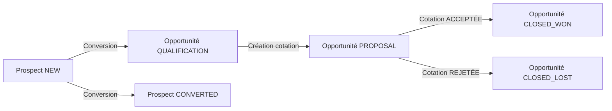

# 🔄 Synchronisation Complète : Prospects ↔ Opportunités ↔ Cotations

**Date de création :** 20 octobre 2025  
**Projet :** Velosi ERP - Module CRM  
**Version :** 2.0

---

## 📋 Table des Matières

1. [Vue d'ensemble](#vue-densemble)
2. [Architecture des entités](#architecture-des-entités)
3. [Flux de synchronisation](#flux-de-synchronisation)
4. [Statuts métiers](#statuts-métiers)
5. [Règles de synchronisation](#règles-de-synchronisation)
6. [Pipeline Kanban](#pipeline-kanban)
7. [Exemples de scénarios](#exemples-de-scénarios)
8. [Implémentation technique](#implémentation-technique)

---

## 🎯 Vue d'ensemble

Le système CRM Velosi implémente une **synchronisation unidirectionnelle** entre trois entités principales :

```
PROSPECT (Lead) → OPPORTUNITÉ (Opportunity) → COTATION (Quote)
```

### Principes de base

1. **Un prospect devient une opportunité** via la conversion
2. **Une opportunité peut avoir plusieurs cotations**
3. **Une cotation acceptée clôture automatiquement l'opportunité**
4. **Les statuts se propagent de droite à gauche** (Quote → Opportunity → Lead)

---

## 🏗️ Architecture des Entités

### 1️⃣ Prospect (Lead)

**Entité :** `crm_leads`  
**Fichier :** `src/entities/crm/lead.entity.ts`

#### Statuts du Prospect (LeadStatus)

| Statut | Code | Description | Métier |
|--------|------|-------------|--------|
| 🆕 **Nouveau** | `NEW` | Prospect juste créé, non encore contacté | ✅ Oui |
| 📞 **Contacté** | `CONTACTED` | Premier contact effectué | ✅ Oui |
| ✅ **Qualifié** | `QUALIFIED` | Prospect qualifié, intérêt confirmé | ✅ Oui |
| ❌ **Non qualifié** | `UNQUALIFIED` | Prospect ne correspond pas aux critères | ✅ Oui |
| 🌱 **En maturation** | `NURTURING` | Prospect à suivre sur le long terme | ✅ Oui |
| 🔄 **Converti** | `CONVERTED` | Converti en opportunité | ⚙️ Automatique |
| 💔 **Perdu** | `LOST` | Prospect perdu définitivement | ✅ Oui |

**Statuts métiers marquants :** NEW, CONTACTED, QUALIFIED, UNQUALIFIED, NURTURING, LOST  
**Statut automatique :** CONVERTED (lors de la conversion en opportunité)

---

### 2️⃣ Opportunité (Opportunity)

**Entité :** `crm_opportunities`  
**Fichier :** `src/entities/crm/opportunity.entity.ts`

#### Étapes de l'Opportunité (OpportunityStage)

| Étape | Code | Probabilité | Description | Pipeline |
|-------|------|-------------|-------------|----------|
| 🎯 **Prospection** | `PROSPECTING` | 10% | Recherche de prospects | Colonne 1 |
| ✅ **Qualification** | `QUALIFICATION` | 25% | Validation du besoin | Colonne 2 |
| 📊 **Analyse besoins** | `NEEDS_ANALYSIS` | 40% | Étude détaillée | Colonne 3 |
| 📄 **Proposition** | `PROPOSAL` | 60% | Cotation envoyée | Colonne 4 |
| 🤝 **Négociation** | `NEGOTIATION` | 80% | Discussion des termes | Colonne 5 |
| ✅ **Gagnée** | `CLOSED_WON` | 100% | Affaire conclue | Colonne 6 |
| ❌ **Perdue** | `CLOSED_LOST` | 0% | Affaire perdue | Colonne 7 |

---

### 3️⃣ Cotation (Quote)

**Entité :** `crm_quotes`  
**Fichier :** `src/crm/entities/quote.entity.ts`

#### Statuts de la Cotation (QuoteStatus)

| Statut | Code | Description | Action suivante | Synchronisation |
|--------|------|-------------|-----------------|-----------------|
| ✏️ **Brouillon** | `DRAFT` | Cotation en création | Envoi | - |
| 📤 **Envoyée** | `SENT` | Envoyée au client | Vue/Acceptée/Rejetée | - |
| 👁️ **Vue** | `VIEWED` | Consultée par le client | Acceptée/Rejetée | - |
| ✅ **Acceptée** | `ACCEPTED` | Acceptée par le client | - | → Opportunity = CLOSED_WON |
| ❌ **Rejetée** | `REJECTED` | Rejetée par le client | - | → Opportunity = CLOSED_LOST |
| ⏰ **Expirée** | `EXPIRED` | Dépassement de validité | - | - |
| 🚫 **Annulée** | `CANCELLED` | Annulée manuellement | - | - |

---

## 🔄 Flux de Synchronisation

### Flux Principal



### Synchronisation Automatique

#### 1. Prospect → Opportunité

```typescript
// Lors de la conversion
lead.status = LeadStatus.CONVERTED;
opportunity.stage = OpportunityStage.QUALIFICATION;
```

**Fichier :** `src/services/crm/opportunity.service.ts`  
**Méthode :** `convertFromLead()`

---

#### 2. Cotation → Opportunité (Création)

```typescript
// Lors de la création d'une cotation depuis une opportunité
if (quote.opportunityId) {
  opportunity.stage = OpportunityStage.PROPOSAL;
  opportunity.probability = 60;
}
```

**Fichier :** `src/crm/services/quotes.service.ts`  
**Méthode :** `create()` → `moveOpportunityToProposal()`

---

#### 3. Cotation → Opportunité (Acceptation)

```typescript
// Lors de l'acceptation d'une cotation
if (quote.status === QuoteStatus.ACCEPTED && quote.opportunityId) {
  opportunity.stage = OpportunityStage.CLOSED_WON;
  opportunity.probability = 100;
  opportunity.actualCloseDate = new Date();
  opportunity.wonDescription = `Cotation ${quote.quoteNumber} acceptée`;
}
```

**Fichier :** `src/crm/services/quotes.service.ts`  
**Méthode :** `acceptQuote()` → `updateOpportunityStage()`

---

#### 4. Cotation → Opportunité (Rejet)

```typescript
// Lors du rejet d'une cotation
if (quote.status === QuoteStatus.REJECTED && quote.opportunityId) {
  opportunity.stage = OpportunityStage.CLOSED_LOST;
  opportunity.probability = 0;
  opportunity.actualCloseDate = new Date();
  opportunity.lostReason = `Cotation ${quote.quoteNumber} rejetée: ${reason}`;
}
```

**Fichier :** `src/crm/services/quotes.service.ts`  
**Méthode :** `rejectQuote()` → `updateOpportunityStage()`

---

## 📊 Statuts Métiers

### Prospects - Statuts Métiers Marquants

Les statuts suivants sont **gérés manuellement** par les commerciaux :

| Statut | Quand l'utiliser | Action recommandée |
|--------|------------------|-------------------|
| 🆕 NEW | Prospect juste ajouté | Contacter sous 24h |
| 📞 CONTACTED | Après premier contact | Qualifier le besoin |
| ✅ QUALIFIED | Besoin validé | Convertir en opportunité |
| ❌ UNQUALIFIED | Pas de besoin réel | Archiver |
| 🌱 NURTURING | Intérêt futur | Programmer relances |
| 💔 LOST | Définitivement perdu | Archiver |

**❗ Règle importante :** Le statut `CONVERTED` est **automatiquement** appliqué lors de la conversion et ne doit **jamais** être appliqué manuellement.

---

## 📋 Règles de Synchronisation

### Règle 1 : Conversion Prospect → Opportunité

```
SI Prospect.status = QUALIFIED
ET Action = "Convertir en opportunité"
ALORS
  - Créer Opportunity avec stage = QUALIFICATION
  - Mettre Lead.status = CONVERTED
  - Lead.convertedDate = Date actuelle
```

**Code :**
```typescript
// opportunity.service.ts - ligne 237
async convertFromLead(leadId: number, convertDto: ConvertLeadToOpportunityDto, userId: number)
```

---

### Règle 2 : Création Cotation → Déplacement Opportunité

```
SI Création de Quote avec opportunityId
ALORS
  - Opportunity.stage = PROPOSAL
  - Opportunity.probability = 60
```

**Code :**
```typescript
// quotes.service.ts - ligne 160
if (savedQuote.opportunityId) {
  await this.moveOpportunityToProposal(savedQuote.opportunityId);
}
```

---

### Règle 3 : Cotation Acceptée → Opportunité Gagnée

```
SI Quote.status = ACCEPTED
ET Quote.opportunityId existe
ALORS
  - Opportunity.stage = CLOSED_WON
  - Opportunity.probability = 100
  - Opportunity.actualCloseDate = Date actuelle
  - Opportunity.wonDescription = Description
```

**Code :**
```typescript
// quotes.service.ts - ligne 693
if (updatedQuote.opportunityId) {
  await this.updateOpportunityStage(
    updatedQuote.opportunityId,
    'closed_won',
    `Cotation ${updatedQuote.quoteNumber} acceptée`
  );
}
```

---

### Règle 4 : Cotation Rejetée → Opportunité Perdue

```
SI Quote.status = REJECTED
ET Quote.opportunityId existe
ALORS
  - Opportunity.stage = CLOSED_LOST
  - Opportunity.probability = 0
  - Opportunity.actualCloseDate = Date actuelle
  - Opportunity.lostReason = Raison
```

**Code :**
```typescript
// quotes.service.ts - ligne 934
if (updatedQuote.opportunityId) {
  await this.updateOpportunityStage(
    updatedQuote.opportunityId,
    'closed_lost',
    `Cotation ${updatedQuote.quoteNumber} rejetée: ${reason}`
  );
}
```

---

### Règle 5 : Cotation Annulée

```
SI Quote.status = CANCELLED
ALORS
  - Aucune synchronisation avec l'opportunité
  - L'opportunité reste dans son état actuel
  - Possibilité de créer une nouvelle cotation
```

**Code :**
```typescript
// quotes.service.ts - ligne 945
async cancelQuote(id: number, reason?: string): Promise<Quote> {
  quote.status = QuoteStatus.CANCELLED;
  // Pas de synchronisation avec l'opportunité
}
```

---

## 🎨 Pipeline Kanban

### Affichage dans le Pipeline

#### Colonne "Prospection" (PROSPECTING)

**Affiche :**
1. ✅ **Prospects avec statut NEW** (leads)
2. ✅ **Opportunités en étape PROSPECTING**

**Code :**
```typescript
// pipeline.service.ts - ligne 174
.where('lead.status = :status', { status: LeadStatus.NEW })
```

**Règle d'affichage :**
```
SI Lead.status = NEW
ALORS Afficher dans colonne "Prospection"

SI Opportunity.stage = PROSPECTING
ALORS Afficher dans colonne "Prospection"
```

---

#### Autres Colonnes

| Colonne | Étape | Contenu | Probabilité |
|---------|-------|---------|-------------|
| **Qualification** | QUALIFICATION | Opportunités en qualification | 25% |
| **Analyse besoins** | NEEDS_ANALYSIS | Opportunités en analyse | 40% |
| **Proposition** | PROPOSAL | Opportunités avec cotations | 60% |
| **Négociation** | NEGOTIATION | Opportunités en négociation | 80% |
| **Gagnées** | CLOSED_WON | Opportunités gagnées | 100% |
| **Perdues** | CLOSED_LOST | Opportunités perdues | 0% |

---

## 📝 Exemples de Scénarios

### Scénario 1 : Conversion Réussie

```
1️⃣ Prospect créé → Status = NEW
   └─ Affichage : Pipeline "Prospection"

2️⃣ Premier contact → Status = CONTACTED
   └─ Reste dans "Prospection" (mais n'est plus affiché car status ≠ NEW)

3️⃣ Qualification OK → Status = QUALIFIED
   └─ Prêt pour conversion

4️⃣ Conversion en opportunité
   ├─ Prospect.status = CONVERTED
   └─ Opportunity.stage = QUALIFICATION
       └─ Affichage : Pipeline "Qualification"

5️⃣ Création cotation
   ├─ Quote.status = DRAFT
   └─ Opportunity.stage = PROPOSAL (auto)
       └─ Affichage : Pipeline "Proposition"

6️⃣ Envoi cotation
   └─ Quote.status = SENT

7️⃣ Client consulte
   └─ Quote.status = VIEWED

8️⃣ Client accepte
   ├─ Quote.status = ACCEPTED
   └─ Opportunity.stage = CLOSED_WON (auto)
       └─ Affichage : Pipeline "Gagnées"
```

---

### Scénario 2 : Prospect Non Qualifié

```
1️⃣ Prospect créé → Status = NEW
   └─ Affichage : Pipeline "Prospection"

2️⃣ Contact et analyse
   └─ Status = CONTACTED

3️⃣ Pas de besoin réel
   └─ Status = UNQUALIFIED
       └─ N'apparaît plus dans le pipeline
```

---

### Scénario 3 : Cotation Rejetée

```
1️⃣ Opportunité en proposition
   └─ Stage = PROPOSAL

2️⃣ Cotation envoyée
   └─ Quote.status = SENT

3️⃣ Client refuse
   ├─ Quote.status = REJECTED
   ├─ Quote.rejectionReason = "Prix trop élevé"
   └─ Opportunity.stage = CLOSED_LOST (auto)
       ├─ Opportunity.lostReason = "Cotation Q25/042 rejetée: Prix trop élevé"
       └─ Affichage : Pipeline "Perdues"
```

---

### Scénario 4 : Plusieurs Cotations

```
1️⃣ Opportunité → Stage = QUALIFICATION

2️⃣ Création cotation #1
   └─ Opportunity.stage = PROPOSAL (auto)

3️⃣ Cotation #1 rejetée
   └─ Opportunity.stage = CLOSED_LOST (auto)

❌ ERREUR : Impossible de créer cotation #2
   └─ Validation : Opportunité fermée

✅ SOLUTION : Ne pas synchroniser automatiquement le rejet
   OU : Permettre plusieurs cotations avant clôture
```

**⚠️ Point d'attention :** Actuellement, le système clôture automatiquement l'opportunité au premier rejet. Cela peut poser problème si plusieurs cotations sont nécessaires.

**💡 Recommandation :** Implémenter une logique "clôture uniquement si toutes les cotations sont rejetées".

---

## 🔧 Implémentation Technique

### Fichiers Modifiés

#### Backend

| Fichier | Modifications | Lignes |
|---------|--------------|--------|
| `quotes.service.ts` | Ajout `cancelQuote()` | +30 |
| `quotes.service.ts` | Ajout `moveOpportunityToProposal()` | +40 |
| `quotes.controller.ts` | Ajout endpoint `/cancel` | +8 |
| `pipeline.service.ts` | Filtre prospects NEW uniquement | +1 |
| `pipeline.service.ts` | Méthode `transformLeadToKanbanOpportunity()` | +55 |

#### Frontend

| Fichier | Modifications | Lignes |
|---------|--------------|--------|
| `quotes.service.ts` | Ajout méthode `cancel()` | +7 |
| `quotes.component.html` | Bouton "Marquer comme annulée" | +15 |
| `quotes.component.html` | Modal confirmation annulation | +35 |
| `quotes.component.ts` | Méthodes `openCancelQuoteModal()`, `confirmCancelQuote()` | +60 |

---

### API Endpoints

#### POST `/crm/quotes/:id/cancel`

**Description :** Annuler une cotation

**Body :**
```json
{
  "reason": "Client a annulé le projet"
}
```

**Réponse :**
```json
{
  "id": 42,
  "quoteNumber": "Q25/042",
  "status": "cancelled",
  "notes": "Annulation: Client a annulé le projet",
  ...
}
```

---

### Méthodes Clés

#### 1. `moveOpportunityToProposal()`

**Fichier :** `quotes.service.ts`  
**Ligne :** ~917

```typescript
private async moveOpportunityToProposal(opportunityId: number): Promise<void> {
  const opportunity = await this.opportunityRepository.findOne({
    where: { id: opportunityId }
  });

  if (opportunity.stage !== OpportunityStage.CLOSED_WON && 
      opportunity.stage !== OpportunityStage.CLOSED_LOST &&
      opportunity.stage !== OpportunityStage.PROPOSAL) {
    
    await this.opportunityRepository.update(opportunityId, {
      stage: OpportunityStage.PROPOSAL,
      probability: 60
    });
  }
}
```

---

#### 2. `transformLeadToKanbanOpportunity()`

**Fichier :** `pipeline.service.ts`  
**Ligne :** ~400

```typescript
private transformLeadToKanbanOpportunity(lead: Lead): KanbanOpportunity {
  return {
    id: lead.id,
    title: `${lead.company} - ${lead.fullName}`,
    value: Number(lead.estimatedValue || 0),
    probability: 10,
    stage: 'prospecting',
    leadId: lead.id,
    ...
  };
}
```

---

## ✅ Checklist de Validation

### Backend ✅

- [x] Prospects NEW affichés dans colonne prospection
- [x] Création cotation → Opportunité en PROPOSAL
- [x] Cotation acceptée → Opportunité CLOSED_WON
- [x] Cotation rejetée → Opportunité CLOSED_LOST
- [x] Cotation annulée → Aucune synchronisation
- [x] Conversion prospect → Status CONVERTED

### Frontend ✅

- [x] Bouton "Marquer comme annulée" dans modal cotation
- [x] Modal de confirmation d'annulation
- [x] Gestion fermeture modale principale avant confirmation
- [x] Timeline enrichie avec historique des statuts
- [x] Affichage prospects dans pipeline

### À Implémenter ⚠️

- [ ] Validation backend : empêcher création cotation sur opportunité fermée
- [ ] Gestion multi-cotations : ne pas clôturer au premier rejet
- [ ] Historique des changements de statut (table d'audit)
- [ ] Notifications automatiques sur changements de statut

---

## 📚 Documentation Associée

- [FAQ Synchronisation](./FAQ_SYNCHRONISATION_OPPORTUNITES_COTATIONS.md)
- [Amélioration Timelines](./AMELIORATION_TIMELINES_ACTIVITES_COTATIONS.md)
- [Guide Cotations](../velosi-front/GUIDE_COTATIONS_LOGISTIQUE.md)

---

## 📞 Support

**Questions ?** Consultez la documentation ou contactez l'équipe de développement.

**Rapporter un bug ?** Créez une issue avec le tag `synchronisation`.

---

**Version :** 2.0  
**Dernière mise à jour :** 20 octobre 2025  
**Auteur :** Assistant IA - Documentation Technique
